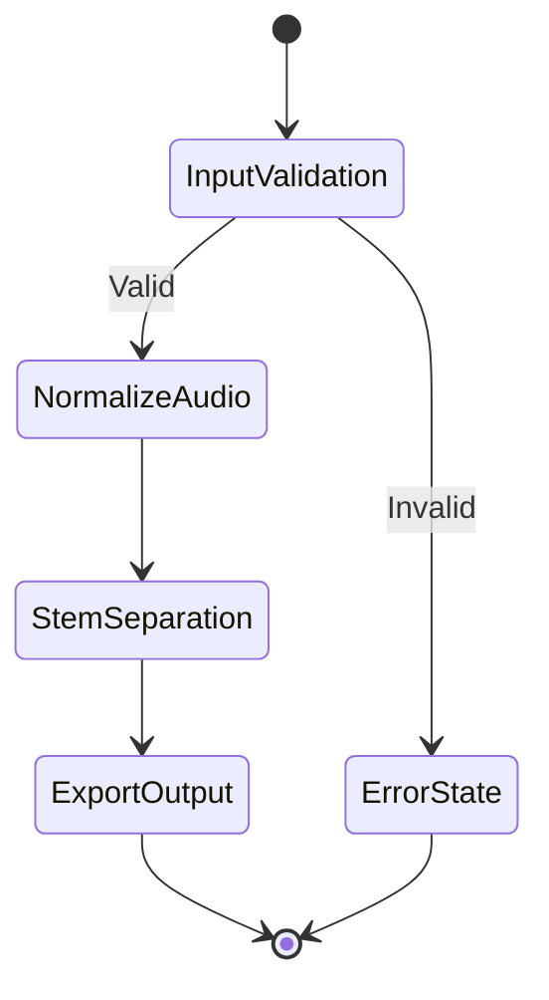

# FMG Repository Development Bible

> **Versión**: v1.0.0  
> **Fecha**: 2026-05-10  
> **Autor**: Jules Martins / Fearless Media Group  
> **Aplica a**: Todos los repositorios FMG  
> **Filosofía**: *Logic dictates. AI executes.*

Este documento es la autoridad técnica definitiva para la creación y mantenimiento de cualquier repositorio bajo el ecosistema FMG. No es una sugerencia. Es un conjunto de leyes técnicas. El humano define la arquitectura y las decisiones. El agente ejecuta dentro de esos límites.

---

## Tabla de Contenidos

1. [Estructura del Repositorio](#1-estructura-del-repositorio)
2. [Git: Commits, Versiones e Higiene](#2-git-commits-versiones-e-higiene)
3. [Documentación: Estándares y Formato](#3-documentación-estándares-y-formato)
4. [Protocolo de Agentes IA](#4-protocolo-de-agentes-ia)
5. [CC Standard: Conscious Code Manifesto](#5-cc-standard-conscious-code-manifesto)
6. [Checklists Operativos](#6-checklists-operativos)

---

## 1. Estructura del Repositorio

### 1.1 Anatomía Mínima Obligatoria

Todo repositorio FMG existe desde el día uno con esta estructura. No es opcional. Para facilitar esto, este repositorio estándar incluye un directorio `/template` que puede ser copiado directamente para iniciar un nuevo proyecto.

```
repo-root/
├── README.md           ← Contrato público del proyecto
├── CHANGELOG.md        ← Historial versionado de cambios
├── LICENSE             ← Tipo de licencia declarado
├── .gitignore          ← Hardened desde el día uno
├── VERSION             ← Fuente única de verdad de la versión
├── docs/
│   ├── wiki/
│   │   ├── index.md    ← Home de la wiki
│   │   └── *.md        ← Guías por dominio
│   ├── AGENT.md        ← SOP para agentes IA (OBLIGATORIO)
│   └── GEMINI.md       ← Reglas específicas para Gemini CLI
└── src/                ← Código fuente (estructura según runtime)
```

> [!IMPORTANT]
> Un repo sin README, CHANGELOG o .gitignore configurado no es un repo. Es un directorio con deuda.

---

### 1.2 Estructura del README

El README es la interfaz pública del proyecto. Define en 30 segundos qué es, qué hace y cómo se usa. Sigue esta estructura ordenada:

```markdown
# Nombre del Proyecto

> Tagline de una línea. Qué hace. Para quién.

![version badge]  ![license badge]  ![status badge]

## Qué es
Descripción técnica concisa. Sin marketing.

## Instalación
Comandos exactos. Copy-paste funcional.

## Uso
Ejemplo mínimo que funciona.

## Arquitectura (opcional)
Diagrama o descripción de componentes clave.

## Changelog
Link a CHANGELOG.md

## Licencia
Tipo de licencia + link.
```

| Elemento | Regla | Límite |
| :--- | :--- | :--- |
| `# H1 Title` | Una sola instancia, igual al nombre del repo | 60 chars |
| `## H2 Section` | Obligatorio post-H1. Sin numerar manualmente. | 40 chars |
| `### H3` | Solo cuando H2 requiere subdivisión real | 40 chars |
| Badges | Solo informativos: versión, licencia, estado. No decoration. | ≤5 |
| Links | Relativos con extensión: `./docs/wiki/index.md` | — |

**Prohibido:** README con screenshots decorativos, GIFs animados de marketing, listas de features sin ejemplos de código, secciones vacías "coming soon".

---

### 1.3 Estructura de la Wiki (`docs/wiki/`)

La wiki documenta el *por qué* y el *cómo*. El README documenta el *qué*. No se mezclan.

```
docs/wiki/
├── index.md            ← TOC + Overview de la wiki
├── architecture.md     ← Decisiones de diseño, ADRs
├── development.md      ← Setup local, flujo de contribución
├── agent-sop.md        ← SOP para agentes IA (OBLIGATORIO si hay IA)
├── hygiene.md          ← Git hygiene, branching, releases
└── [domain].md         ← Un archivo por dominio de conocimiento
```

> [!IMPORTANT]
> Cada archivo wiki tiene un único dominio de responsabilidad. Si no puedes describir el archivo en 5 palabras, está haciendo demasiado.

**Tono de la Wiki — Autoridad Técnica Absoluta:**

| ✓ Correcto | ✗ Prohibido |
| :--- | :--- |
| "El sistema exige `cargo check` antes de commit" | "Se recomienda ejecutar `cargo check`" |
| "PoshBuddy garantiza compilación limpia" | "PoshBuddy intenta mantener compilación limpia" |
| "El motor bloquea el pipeline si..." | "El motor es bloqueado cuando..." |

**Léxico prohibido en toda documentación FMG:**

- *Creo que...*
- *Podría... / Tal vez...*
- *Basado en mi análisis...* (presenta el hecho directamente)
- *Se recomienda...* (usar: "El sistema exige...")
- *[Proyecto] intenta...* (usar: "[Proyecto] garantiza...")

---

### 1.4 Hardening del `.gitignore`

El `.gitignore` se configura en el commit inicial y se mantiene activo. No es un documento que se edita "cuando hay problema".

**Siempre excluir:**

```gitignore
# Logs y temporales
*.log
*.tmp
*.bak
cargo_*.txt
debug_*.txt

# Entorno
.env
.env.*
*.local

# Manifiestos locales
.manifests/

# Build artifacts
target/
dist/
build/
__pycache__/
*.pyc
.pytest_cache/
node_modules/
.next/

# IDE personal
.vscode/settings.json
.idea/
*.suo
.DS_Store
Thumbs.db
```

**Nunca trackear:** credenciales, API keys, archivos de sesión personal, output de builds locales, symlinks a rutas absolutas.

> [!IMPORTANT]
> Antes de cada commit: `git status` completo. Si aparece algo inesperado, se agrega al `.gitignore` antes de continuar.

---

### 1.5 Licencias y Metadata del Repo

| Caso de Uso | Licencia Recomendada |
| :--- | :--- |
| Herramientas de desarrollo FOSS | MIT o Apache 2.0 |
| Librerías de uso libre con atribución | MIT |
| Proyectos FMG internos | Propietaria / All Rights Reserved |
| Plugins/extensiones de OSS existente | Misma licencia del proyecto padre |
| Contenido educativo / docs | CC BY 4.0 |

GitHub Topics configurados desde el inicio. Mínimo 3 topics relevantes. La descripción del repo en GitHub replica exactamente el tagline del README.

---

## 2. Git: Commits, Versiones e Higiene

### 2.1 Anatomía de un Commit Atómico

Un commit atómico:

- Hace una **única** cosa lógica
- Compila/ejecuta sin errores
- Es entendible en aislamiento
- Puede revertirse sin romper nada

**Regla de Oro:**

```
Una feature    = un commit
Un bugfix      = un commit
Un refactor    = un commit separado
Cambios docs   = un commit separado
Version bump   = un commit separado
CHANGELOG      = un commit separado
```

**Formato Conventional Commits:**

```
<type>(<scope>): <subject>

<body — QUÉ y POR QUÉ, no CÓMO. Ajustar a 72 chars/línea.>

<footer — Fixes #123 / BREAKING CHANGE: descripción>
```

**Reglas de formato del subject:**

- Modo imperativo: "add", "fix", "remove" — nunca "added", "fixing"
- Minúscula
- Sin punto al final
- Máximo 50 caracteres

---

### 2.2 Tabla de Tipos de Commit

| Tipo | Dominio | SemVer Impact |
| :--- | :--- | :--- |
| `feat` | Nueva funcionalidad | MINOR |
| `fix` | Corrección de bug | PATCH |
| `perf` | Optimización de rendimiento | PATCH |
| `refactor` | Reorganización sin cambio funcional | NONE |
| `docs` | Documentación, wiki, README | NONE |
| `style` | UI/visual sin cambio de lógica | NONE |
| `test` | Tests nuevos o reparados | NONE |
| `chore` | Deps, config, release bumps | NONE |
| `ci` | CI/CD pipeline changes | NONE |
| `BREAKING CHANGE` | Cualquier tipo con API incompatible | MAJOR |

**Ley de Mayor Impacto:** Si hay un `feat` y un `fix` en el mismo lote de cambios, el incremento es MINOR. La regla de mayor impacto prevalece siempre.

**Ejemplos reales:**

```bash
feat(cli): add UVR integration for stem separation

Implement Ultimate Vocal Remover pipeline as optional step.
Activated via --stems flag. Requires uvr binary in PATH.

Closes #47

---

fix(bridge): handle discarded audio bytes in protocol

Previously the bridge silently dropped bytes when buffer
was full. Now blocks until ACK is received.

---

refactor(parser): split monolithic parse function

Extract state machine into dedicated methods.
No functional changes. Improves testability.

---

docs(wiki): update agent SOP for pipeline orchestrator

---

chore(release): bump version to 1.3.0
```

---

### 2.3 Versionado Semántico (SemVer)

Formato: `MAJOR.MINOR.PATCH` — Pre-release: `v1.0.0-beta.1`

| Componente | Cuándo | Ejemplo |
| :--- | :--- | :--- |
| MAJOR | Breaking changes. API incompatible. Parámetros cambian. | 1.2.3 → 2.0.0 |
| MINOR | Nueva funcionalidad backward-compatible. | 1.2.3 → 1.3.0 |
| PATCH | Bugfixes. Security patches. Performance. | 1.2.3 → 1.2.4 |

**Ley de Unicidad de Fuente:** La versión en el archivo de manifest del proyecto (`Cargo.toml`, `pyproject.toml`, `package.json`, `VERSION`) DEBE coincidir exactamente con el último tag de Git y la entrada superior del `CHANGELOG.md`. Tres fuentes, un número.

**Ubicaciones por runtime:**

```toml
# Rust — Cargo.toml
[package]
version = "1.3.0"
```

```toml
# Python — pyproject.toml
[project]
version = "1.3.0"
```

```json
// Node — package.json
{ "version": "1.3.0" }
```

```
# Genérico — VERSION file
1.3.0
```

**Flujo de Version Bump:**

```bash
# 1. Determinar bump leyendo commits desde último tag
git log --oneline vX.Y.Z..HEAD

# 2. Actualizar archivo de versión
echo "1.3.0" > VERSION

# 3. Commit de versión
git add VERSION
git commit -m "chore(release): bump version to 1.3.0"

# 4. Actualizar CHANGELOG (ver sección 2.4)
git add CHANGELOG.md
git commit -m "docs(changelog): update for v1.3.0"

# 5. Tag anotado
git tag -a v1.3.0 -m "Release v1.3.0"

# 6. Push completo
git push origin main
git push origin v1.3.0
```

---

### 2.4 CHANGELOG: Estructura y Protocolo

El CHANGELOG es la memoria pública del proyecto. Sigue [Keep a Changelog](https://keepachangelog.com) + SemVer.

```markdown
# Changelog

All notable changes to this project will be documented in this file.
Format: keepachangelog.com · Versioning: semver.org

## [Unreleased]

## [1.3.0] - 2026-05-10

### Added
- UVR stem separation pipeline via `--stems` flag

### Fixed
- Bridge protocol no longer silently discards audio bytes

### Changed
- Parser refactored into discrete state machine methods

## [1.2.3] - 2026-04-01

### Fixed
- Memory leak in session management
```

| Sección | Uso |
| :--- | :--- |
| `Added` | Funcionalidad nueva |
| `Changed` | Cambios en funcionalidad existente |
| `Deprecated` | Features que serán eliminadas |
| `Removed` | Features eliminadas |
| `Fixed` | Bug fixes |
| `Security` | Patches de seguridad |

**Prohibido:** Entradas genéricas como "Various fixes" o "Code improvements". Cada entrada describe un cambio concreto y user-facing.

---

### 2.5 Higiene de Ramas

| Tipo | Naming | Vida útil |
| :--- | :--- | :--- |
| Producción estable | `main` | Permanente |
| Integración (si aplica) | `dev` | Permanente (proyectos colaborativos) |
| Feature | `feat/nombre-corto` | Hasta merge → eliminar |
| Bugfix | `fix/descripcion-bug` | Hasta merge → eliminar |
| Refactor | `refactor/componente` | Hasta merge → eliminar |

**Protocolo de limpieza post-merge:**

```bash
# Eliminar rama local
git branch -d feat/mi-feature

# Eliminar rama remota
git push origin --delete feat/mi-feature

# Limpiar referencias fantasma
git remote prune origin

# Verificar
git branch -a
```

> [!IMPORTANT]
> **Anti-Force:** Prohibido `git push --force` a `main`. Único caso permitido: rama de feature aislada, bajo justificación extrema documentada en el commit body.

> [!IMPORTANT]
> **Anti-Merge Commit:** Historial lineal obligatorio en `main`. Usar `git pull --rebase` siempre. En ramas compartidas, usar `git merge`. Nunca `git pull` sin `--rebase`.

---

### 2.6 Protocolo Pre-Push Completo

```bash
# 1. Estado del working tree — debe estar limpio
git status

# 2. Revisar commits a subir
git log --oneline origin/main..HEAD

# 3. ¿Son atómicos? ¿Mensajes correctos?
# Si no → rebase interactivo
git rebase -i origin/main
# Opciones: pick / reword / squash / fixup / drop

# 4. Build/compile exitoso (según runtime)
cargo check           # Rust
python -m py_compile src/main.py  # Python
npm run build         # Node

# 5. Tests
cargo test / pytest / npm test

# 6. Segunda revisión de status — nada filtrado
git status

# 7. Push
git push origin main
git push origin vX.Y.Z   # Si hay release
```

---

### 2.7 Trampas Comunes y Recuperación

| Trampa | Síntoma | Solución |
| :--- | :--- | :--- |
| Merge commit en main | `Merge branch 'X'` en log | `git rebase -i origin/main` → drop merge commit |
| Tag olvidado | Release sin tag | `git tag -a vX.Y.Z -m "..." && git push origin vX.Y.Z` |
| Versión inconsistente | VERSION ≠ tag ≠ CHANGELOG | Commit corrector con todos los archivos. Tag apunta al fix. |
| Tag sin push | Tag local, no remoto | `git push origin --tags` |
| Rebase en rama compartida | Historial divergente para otros | Nunca rebase en shared branches. Solo merge. |
| Archivos no deseados en staging | `.env` aparece en `git status` | `git rm --cached .env` → agregar a `.gitignore` |

---

## 3. Documentación: Estándares y Formato

### 3.1 Estándares de Markdown

| Elemento | Regla | Límite |
| :--- | :--- | :--- |
| `# H1` | Una instancia por archivo, igual al título del doc | 60 chars |
| `## H2` | Secciones principales. Sin numerar manualmente. | 40 chars |
| `### H3` | Solo cuando H2 requiere subdivisión real | 40 chars |
| Alertas | Max 2 por sección. Nunca consecutivas. | — |
| Links | Relativos con extensión: `./file.md`. Nunca `file:///` | — |
| Tablas | Solo datos estructurados. No decorativas. | — |
| Code blocks | Language tag siempre: ` ```bash `, ` ```python `, ` ```rust ` | — |

---

### 3.2 Diagramas con Mermaid

| Tipo de Diagrama | Formato Mermaid |
| :--- | :--- |
| Flujos de estado | `stateDiagram-v2` |
| Dependencias / arquitectura | `graph TD` o `graph LR` |
| Secuencias | `sequenceDiagram` |
| Timelines / releases | `timeline` |

**Reglas:**

- Nodos en `PascalCase`: `ConnectivityCheck`, `FetchData`, `ParseResult`
- Descripciones de flechas: verbos en infinitivo: `--> |Download|`, `--> |Validate|`
- Diagramas son máquinas de estado puras, no arte. Sin nodos redundantes ni flechas decorativas.

**Ejemplo:**



---

### 3.3 Architecture Decision Records (ADR)

Cada decisión técnica no trivial se documenta. Ubicación: `docs/wiki/architecture.md` o archivos individuales `docs/adr/NNNN-titulo.md`.

```markdown
# ADR 0001: Usar WaveTerm como GUI Unificado

**Estado**: Aceptado  
**Fecha**: 2026-05-10  

## Contexto
Necesitamos una interfaz gráfica para ducer-cli sin construir una desde cero.

## Decisión
Integrar WaveTerm como shell gráfico sobre el CLI existente.

## Consecuencias
- Positivas: time-to-ship reducido, ecosistema de plugins existente.
- Negativas: dependencia externa, limitaciones del modelo de extensión.
```

**Ley del Contexto Preservado:** Los ADRs nunca se eliminan ni se sobreescriben. Se marcan como `Supersedido por ADR XXXX`. La historia de decisiones es documentación primaria.

---

### 3.4 Docstrings y Comentarios en Código

**Ley de Preservación:** Prohibido eliminar comentarios o docstrings existentes a menos que sean técnicamente incorrectos. La preservación del contexto es prioridad sobre la limpieza estética.

| Comentar | No comentar |
| :--- | :--- |
| El POR QUÉ de una decisión no obvia | Lo que el código claramente dice |
| Workarounds con su explicación | Nombres de variables obvias |
| Comportamientos contra-intuitivos | Cada línea de código |
| TODOs con fecha y contexto | El historial de cambios (para eso está git) |

```rust
// WORKAROUND: UMC404HD drops first 512 bytes on cold start.
// Confirmed with Behringer support ticket #48291.
// Remove when firmware ≥ 3.2 is widespread.
let _ = reader.read(&mut warmup_buf);
```

---

## 4. Protocolo de Agentes IA

### 4.1 Filosofía de Integración

> **"Logic dictates. AI executes."**

El humano define la arquitectura, los contratos y las decisiones. El agente implementa dentro de esos límites. El agente IA es un ejecutor de alta velocidad, no un arquitecto. Su valor está en la velocidad de ejecución dentro de un contexto bien definido.

**Un agente sin SOP es ruido. Un agente con SOP es multiplicador de fuerza.**

> [!IMPORTANT]
> Nunca dar a un agente acceso de escritura irrestricto a `main` sin pipeline de validación. Nunca usar un agente para tomar decisiones de arquitectura sin revisión humana. Un agente que toma decisiones sin el humano es un liability, no un asset.

---

### 4.2 Archivos de Configuración del Agente

Todo proyecto que integre agentes IA mantiene los siguientes archivos:

```
docs/
├── AGENT.md       ← SOP del agente para este proyecto específico
├── GEMINI.md      ← Reglas para Gemini CLI (si aplica)
├── SOUL.md        ← Identidad y principios del agente
├── IDENTITY.md    ← Rol específico del agente en este contexto
└── MEMORY.md      ← Estado de contexto persistente entre sesiones
```

**Estructura mínima de `AGENT.md`:**

```markdown
# Agent SOP: [Nombre del Proyecto]

## Rol
[Qué hace el agente en este proyecto. Una sola oración.]

## Stack y Contexto
[Runtime, versiones, directorios clave, convenciones activas.]

## Leyes de Operación
1. Lee el archivo relevante antes de modificarlo.
2. Ejecuta compilación/check ANTES de reportar éxito.
3. Un cambio lógico por operación. Sin mega-parches.
4. Preservar comentarios y docstrings existentes.
5. Reportar bloqueantes. No inventar soluciones no especificadas.
6. Nunca `git push --force` a main.

## Rutas Clave
- Source: [path absoluto]
- Config: [path absoluto]
- Output: [path absoluto]

## Comandos Frecuentes
[Los comandos que el agente ejecutará regularmente.]

## Criterio de Éxito
[Cómo sabe el agente que una tarea está terminada.]
```

---

### 4.3 Leyes de Operación del Agente

| Ley | Descripción |
| :--- | :--- |
| **Ley de Contexto** | Nunca modifiques dos componentes lógicamente distintos en el mismo paso. Un dominio por operación. |
| **Ley de Verificación** | Todo cambio en `src/` es precedido por compilación exitosa. No se asume que funciona. |
| **Ley de Ruta** | Antes de escribir un archivo, verificar si la ruta es absoluta o relativa. Paths forward-slash por defecto en entornos mixtos. |
| **Ley de Preservación** | Prohibido eliminar comentarios o docstrings sin justificación técnica explícita. |
| **Ley de Transparencia** | El agente reporta bloqueantes. No inventa workarounds no especificados. No asume éxito sin verificación. |
| **Ley de Aislamiento** | Antes de borrados masivos: generar lista de objetivos y esperar validación humana. |

**Flujo de operación estándar:**

```
1. Leer los archivos relevantes antes de modificar.
2. Ejecutar la operación en el scope mínimo necesario.
3. Verificar resultado (compile / test / git status).
4. Reportar resultado con evidencia, no con suposición.
5. Esperar instrucción antes del siguiente paso en pipelines críticos.
```

---

### 4.4 Permisos Git del Agente

| Acción | Permitido |
| :--- | :--- |
| Commits atómicos con Conventional Commits | ✓ Sí |
| Crear ramas de feature | ✓ Sí |
| `git rebase` con instrucciones explícitas del humano | ✓ Sí |
| `git push origin main` (cambios revisados) | ✓ Sí, con autorización |
| `git push --force` a `main` | ✗ Nunca |
| Merge a `main` sin revisión humana | ✗ Nunca |
| Version bumps sin instrucción explícita | ✗ Nunca |
| Eliminación de tags existentes | ✗ Nunca |
| Rebase en ramas compartidas | ✗ Nunca |

**Patrón de commit desde agente:**

```bash
git add <archivo-especifico>     # Nunca git add .
git status                       # Verificar staging
git commit -m "fix(parser): handle edge case in path resolution"
git log --oneline -1             # Confirmar resultado
```

---

### 4.5 Prompts de Alta Fidelidad

La calidad del output del agente es directamente proporcional a la calidad del contexto provisto.

| Elemento | Por qué importa |
| :--- | :--- |
| Stack explícito | Runtime + versiones. El agente no adivina. |
| Ruta absoluta de archivos clave | Elimina ambigüedad de paths. |
| Estado actual + estado deseado | "Actualmente X, necesito Y" supera "arregla esto". |
| Restricciones explícitas | "Sin tocar `auth.rs`", "solo el loop principal". |
| Criterio de éxito | "Listo cuando `cargo test` pasa sin warnings". |

**Plantilla de prompt de alta fidelidad:**

```
Contexto: [Proyecto / Stack / Versión]
Archivo objetivo: [ruta absoluta]
Estado actual: [descripción técnica del problema]
Estado deseado: [resultado esperado específico]
Restricciones: [qué NO tocar]
Criterio de éxito: [cómo verificar que está correcto]
```

---

## 5. CC Standard: Conscious Code Manifesto

El Conscious Code Standard aplica a todo código producido bajo FMG, ya sea por humano o agente. El código consciente no es aquel que funciona. Es aquel que puede ser leído, auditado, mantenido y transferido sin pérdida de intención.

---

### Principio I — Soberanía Cognitiva

El desarrollador mantiene comprensión total de cada línea que firma. El código generado por IA que no se entiende no se commitea.

Usar IA para generar código que no entiendes es deuda cognitiva. Tarde o temprano la pagas con un bug que no puedes diagnosticar. El agente acelera la ejecución de decisiones humanas — no las reemplaza.

---

### Principio II — Los Fallos son Documentación Primaria

Los errores se documentan donde ocurren, con contexto suficiente para reproducirlos. Un bug sin post-mortem es una deuda que se paga dos veces.

```
# Formato de documentación de fallo:
# BUG: descripción de qué fallaba y cómo se manifestaba.
# FIX: descripción de la corrección y por qué funciona.
# LESSON: qué se aprendió / qué evitar en el futuro.
```

---

### Principio III — Atomicidad de Responsabilidad

Cada función hace una cosa. Cada módulo tiene un dominio. Cada commit encapsula un cambio. La atomicidad no es un estilo — es la condición mínima de mantenibilidad.

La violación de atomicidad es el origen de la mayoría de los bugs de producción. Una función que hace dos cosas tiene dos razones para fallar.

---

### Principio IV — Trazabilidad Total

Toda decisión técnica no trivial tiene un rastro: en el commit, en el ADR, o en un comentario inline. Si la decisión no está documentada, técnicamente no existió.

---

### Principio V — Contrato de Interfaces

Las interfaces públicas (APIs, CLIs, módulos exportados) son contratos. Un cambio breaking sin MAJOR bump es una mentira semántica.

SemVer no es burocracia. Es el mecanismo por el cual otros sistemas confían en el tuyo. Romperlo es romper esa confianza.

---

### Principio VI — Mínima Superficie de Riesgo

El código más seguro es el que no existe. Cada dependencia es una superficie de ataque. Cada feature no esencial es deuda de mantenimiento. La simplicidad es una decisión técnica, no estética.

---

### Principio VII — Reproducibilidad Determinista

El mismo input produce el mismo output en cualquier ambiente. El código que funciona "solo en mi máquina" no funciona. Las dependencias se pinean. Los builds son reproducibles.

Lock files (`Cargo.lock`, `poetry.lock`, `package-lock.json`) se commitean siempre en proyectos finales. Sin excepción.

---

### Principio VIII — Legibilidad como Feature

El código se escribe una vez y se lee cien veces. La legibilidad no es un lujo posterior — es parte del diseño inicial. El código inteligible sobrevive a su autor.

Nombres que revelan intención. Funciones que caben en una pantalla. Abstracciones que reducen carga cognitiva. Si necesitas un comentario para explicar *qué* hace el código (no por qué), el código falla en legibilidad.

---

## 6. Checklists Operativos

### 6.1 Creación de Nuevo Repositorio

- [ ] `README.md` creado con estructura completa (tagline, install, uso)
- [ ] `CHANGELOG.md` inicializado con entrada `[Unreleased]`
- [ ] `LICENSE` declarado y archivo presente
- [ ] `.gitignore` hardened para el stack del proyecto
- [ ] `VERSION` inicializado en `0.1.0`
- [ ] Tag inicial `v0.1.0` creado y pusheado
- [ ] Descripción y Topics configurados en GitHub
- [ ] Branch `main` como default. Branch protection activa si es colaborativo.
- [ ] `docs/wiki/index.md` creado si el proyecto requiere documentación extensa
- [ ] `docs/AGENT.md` creado si el proyecto integra agentes IA

---

### 6.2 Pre-Commit

- [ ] `git status` revisado — nada inesperado en staging
- [ ] El cambio hace UNA sola cosa lógica
- [ ] El código compila/ejecuta sin errores
- [ ] Mensaje de commit sigue Conventional Commits
- [ ] Subject ≤50 chars, imperativo, minúscula, sin punto final
- [ ] No se eliminaron comentarios o docstrings sin razón técnica
- [ ] Todo código generado por IA fue leído y comprendido

---

### 6.3 Pre-Push / Release

- [ ] `git log --oneline origin/main..HEAD` revisado — commits atómicos y bien nombrados
- [ ] No hay merge commits en el historial
- [ ] `VERSION` actualizado al nuevo número
- [ ] `CHANGELOG.md` actualizado con todos los cambios
- [ ] Versión en manifest del proyecto coincide con `VERSION`
- [ ] Tag `vX.Y.Z` creado con `git tag -a`
- [ ] Tests pasan (si aplica)
- [ ] `git push origin main && git push origin vX.Y.Z` ejecutados
- [ ] Post-push: `git log --oneline origin/main..HEAD` está vacío

---

### 6.4 Higiene de Ramas (Post-Sesión)

- [ ] Todas las ramas de feature/fix mergeadas fueron eliminadas localmente
- [ ] Todas las ramas de feature/fix mergeadas fueron eliminadas en remoto
- [ ] `git remote prune origin` ejecutado
- [ ] `git branch -a` muestra solo ramas permanentes activas
- [ ] `.gitignore` actualizado para cualquier nuevo artefacto detectado

---

### 6.5 Validación de Sesión con Agente IA

- [ ] El agente leyó `AGENT.md` / `GEMINI.md` antes de operar
- [ ] Cada operación del agente fue en scope mínimo (un componente a la vez)
- [ ] El agente verificó compilación antes de reportar éxito
- [ ] No se ejecutó `git push --force` a `main` desde el agente
- [ ] El humano revisó y aprobó cada decisión de arquitectura
- [ ] Todo código generado por agente fue leído y comprendido por el humano

---

### 6.6 Validación de Documentación

- [ ] Todo H1 es único por archivo y ≤60 chars
- [ ] Todo H2 ≤40 chars
- [ ] No hay alertas consecutivas en ninguna sección
- [ ] No hay links absolutos `file:///` o sin extensión
- [ ] Todos los diagramas Mermaid usan `PascalCase` en nodos
- [ ] El tono no usa verbos de duda (podría, sería, intentaría)
- [ ] La versión en `CHANGELOG.md` coincide con `VERSION` y el tag de Git

---

## Referencias

- [Conventional Commits](https://www.conventionalcommits.org/)
- [Keep a Changelog](https://keepachangelog.com/)
- [Semantic Versioning](https://semver.org/)
- [Git Documentation](https://git-scm.com/doc)

---

*FMG Repository Development Bible · v1.0.0 · 2026-05-10*  
*Fearless Media Group · Logic dictates. AI executes.*
