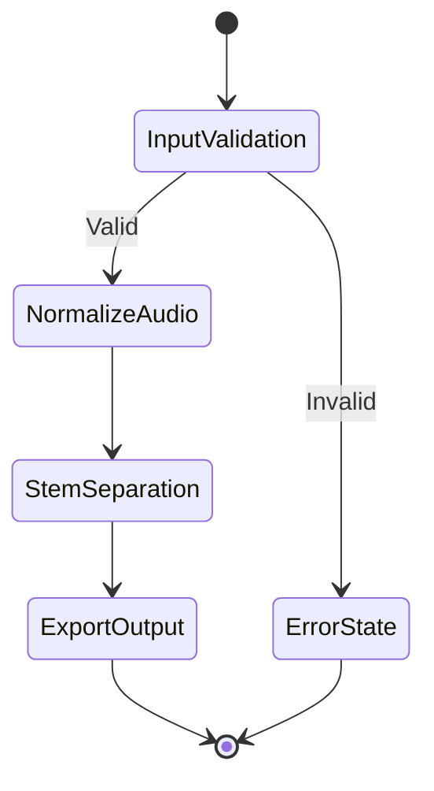

# FMG Repository Development Bible

> **Version**: v1.0.0  
> **Date**: 2026-05-10  
> **Author**: Jules Martins / Fearless Media Group  
> **Applies to**: Every single FMG repository  
> **Philosophy**: *Logic dictates. AI executes.*

This document is the absolute technical authority for creating and maintaining any repository within the FMG ecosystem. It’s not a suggestion. It’s a set of technical laws. Humans define the architecture and make the hard calls. The agent executes within those boundaries. Don't let the machine wander off.

---

## Table of Contents

1. [Repository Structure](#1-repository-structure)
2. [Git: Commits, Versions, and Hygiene](#2-git-commits-versions-and-hygiene)
3. [Documentation: Standards and Format](#3-documentation-standards-and-format)
4. [AI Agent Protocol](#4-ai-agent-protocol)
5. [CC Standard: Conscious Code Manifesto](#5-cc-standard-conscious-code-manifesto)
6. [Operational Checklists](#6-operational-checklists)

---

## 1. Repository Structure

### 1.1 Mandatory Minimum Anatomy

Every FMG repository exists from day one with this structure. It’s not optional. To make your life easier (and keep you from messing up), this standard repo includes a `/template` directory that can be copied directly to start a new project.

```
repo-root/
├── README.md           ← Project's public contract
├── CHANGELOG.md        ← Versioned history of changes
├── LICENSE             ← Declared license type
├── .gitignore          ← Hardened from day one
├── VERSION             ← Single source of truth for the version
├── docs/
│   ├── wiki/
│   │   ├── index.md    ← Wiki home
│   │   └── *.md        ← Domain-specific guides
│   ├── AGENT.md        ← SOP for AI agents (MANDATORY)
│   └── GEMINI.md       ← Specific rules for Gemini CLI
└── src/                ← Source code (structure depends on runtime)
```

> [!IMPORTANT]
> A repo without a README, CHANGELOG, or .gitignore isn't a repo. It’s just a folder full of regret and technical debt.

---

### 1.2 README Structure

The README is the project's public interface. It should define what it is, what it does, and how to use it in 30 seconds. Follow this ordered structure:

```markdown
# Project Name

> One-line tagline. What it does. Who it's for.

![version badge]  ![license badge]  ![status badge]

## What is it?
Concise technical description. No marketing fluff.

## Installation
Exact commands. Functional copy-paste.

## Usage
A minimum working example.

## Architecture (optional)
Diagram or description of key components.

## Changelog
Link to CHANGELOG.md

## License
License type + link.
```

| Element | Rule | Limit |
| :--- | :--- | :--- |
| `# H1 Title` | One instance only, matching the repo name | 60 chars |
| `## H2 Section` | Mandatory post-H1. No manual numbering. | 40 chars |
| `### H3` | Only when H2 actually needs a sub-division | 40 chars |
| Badges | Informational only: version, license, status. No decorations. | ≤5 |
| Links | Relative with extensions: `./docs/wiki/index.md` | — |

**Banned:** READMEs with decorative screenshots, animated marketing GIFs, feature lists without code examples, or "coming soon" sections. If it's not ready, don't list it.

---

### 1.3 Wiki Structure (`docs/wiki/`)

The wiki documents the *why* and the *how*. The README documents the *what*. Don't mix them up.

```
docs/wiki/
├── index.md            ← TOC + Wiki overview
├── architecture.md     ← Design decisions, ADRs
├── development.md      ← Local setup, contribution flow
├── agent-sop.md        ← SOP for AI agents (MANDATORY if AI is involved)
├── hygiene.md          ← Git hygiene, branching, releases
└── [domain].md         ← One file per knowledge domain
```

> [!IMPORTANT]
> Each wiki file has a single domain of responsibility. If you can't describe the file in 5 words, it's doing too much.

**Wiki Tone — Absolute Technical Authority (No "maybe" allowed):**

| ✓ Correct | ✗ Banned |
| :--- | :--- |
| "The system requires `cargo check` before commit" | "It is recommended to run `cargo check`" |
| "PoshBuddy guarantees clean compilation" | "PoshBuddy tries to maintain clean compilation" |
| "The engine blocks the pipeline if..." | "The engine is blocked when..." |

**Banned lexicon in all FMG documentation:**

- *I think...*
- *Could... / Maybe...*
- *Based on my analysis...* (Just state the fact)
- *It is recommended...* (Use: "The system requires...")
- *[Project] tries to...* (Use: "[Project] guarantees...")

---

### 1.4 Hardening the `.gitignore`

The `.gitignore` is configured in the initial commit and stays active. It’s not something you edit only "when there's a problem."

**Always exclude:**

```gitignore
# Logs and temp files
*.log
*.tmp
*.bak
cargo_*.txt
debug_*.txt

# Environment
.env
.env.*
*.local

# Local manifests
.manifests/

# Build artifacts
target/
dist/
build/
__pycache__/
*.pyc
.pytest_cache/
node_modules/
.next/

# Personal IDE stuff
.vscode/settings.json
.idea/
*.suo
.DS_Store
Thumbs.db
```

**Never track:** credentials, API keys, personal session files, local build output, or symlinks to absolute paths.

> [!IMPORTANT]
> Before every commit: run a full `git status`. If something unexpected shows up, add it to `.gitignore` before you proceed.

---

### 1.5 Licenses and Repo Metadata

| Use Case | Recommended License |
| :--- | :--- |
| FOSS development tools | MIT or Apache 2.0 |
| Free libraries with attribution | MIT |
| Internal FMG projects | Proprietary / All Rights Reserved |
| Existing OSS plugins/extensions | Same license as the parent project |
| Educational content / docs | CC BY 4.0 |

Configure GitHub Topics from the start. Minimum 3 relevant topics. The GitHub repo description must exactly match the README tagline.

---

## 2. Git: Commits, Versions, and Hygiene

### 2.1 Anatomy of an Atomic Commit

An atomic commit:

- Does **one single** logical thing
- Compiles/runs without errors
- Is understandable in isolation
- Can be reverted without breaking the world

**Golden Rule:**

```
One feature    = one commit
One bugfix      = one commit
One refactor    = a separate commit
Docs changes    = a separate commit
Version bump    = a separate commit
CHANGELOG       = a separate commit
```

**Conventional Commits Format:**

```
<type>(<scope>): <subject>

<body — WHAT and WHY, not HOW. Wrap at 72 chars/line.>

<footer — Fixes #123 / BREAKING CHANGE: description>
```

**Subject Formatting Rules:**

- Imperative mode: "add", "fix", "remove" — never "added", "fixing"
- Lowercase
- No period at the end
- Maximum 50 characters

---

### 2.2 Commit Types Table

| Type | Domain | SemVer Impact |
| :--- | :--- | :--- |
| `feat` | New functionality | MINOR |
| `fix` | Bug correction | PATCH |
| `perf` | Performance optimization | PATCH |
| `refactor` | Reorganization without functional change | NONE |
| `docs` | Documentation, wiki, README | NONE |
| `style` | UI/visual without logic change | NONE |
| `test` | New or repaired tests | NONE |
| `chore` | Deps, config, release bumps | NONE |
| `ci` | CI/CD pipeline changes | NONE |
| `BREAKING CHANGE` | Any type with incompatible API | MAJOR |

**Law of Greatest Impact:** If there's a `feat` and a `fix` in the same batch, the bump is MINOR. The rule of greatest impact always prevails.

**Real Examples:**

```bash
feat(cli): add UVR integration for stem separation

Implement Ultimate Vocal Remover pipeline as optional step.
Activated via --stems flag. Requires uvr binary in PATH.

Closes #47

---

fix(bridge): handle discarded audio bytes in protocol

Previously the bridge silently dropped bytes when buffer
was full. Now blocks until ACK is received.

---

refactor(parser): split monolithic parse function

Extract state machine into dedicated methods.
No functional changes. Improves testability.

---

docs(wiki): update agent SOP for pipeline orchestrator

---

chore(release): bump version to 1.3.0
```

---

### 2.3 Semantic Versioning (SemVer)

Format: `MAJOR.MINOR.PATCH` — Pre-release: `v1.0.0-beta.1`

| Component | When | Example |
| :--- | :--- | :--- |
| MAJOR | Breaking changes. Incompatible API. Params change. | 1.2.3 → 2.0.0 |
| MINOR | New backward-compatible functionality. | 1.2.3 → 1.3.0 |
| PATCH | Bugfixes. Security patches. Performance. | 1.2.3 → 1.2.4 |

**Law of Single Source:** The version in the project manifest (`Cargo.toml`, `pyproject.toml`, `package.json`, `VERSION`) MUST match the last Git tag and the top entry in `CHANGELOG.md`. Three sources, one number.

**Runtime locations:**

```toml
# Rust — Cargo.toml
[package]
version = "1.3.0"
```

```toml
# Python — pyproject.toml
[project]
version = "1.3.0"
```

```json
// Node — package.json
{ "version": "1.3.0" }
```

```
# Generic — VERSION file
1.3.0
```

**Version Bump Flow:**

```bash
# 1. Determine bump by reading commits since last tag
git log --oneline vX.Y.Z..HEAD

# 2. Update version file
echo "1.3.0" > VERSION

# 3. Version commit
git add VERSION
git commit -m "chore(release): bump version to 1.3.0"

# 4. Update CHANGELOG (see section 2.4)
git add CHANGELOG.md
git commit -m "docs(changelog): update for v1.3.0"

# 5. Annotated tag
git tag -a v1.3.0 -m "Release v1.3.0"

# 6. Full push
git push origin main
git push origin v1.3.0
```

---

### 2.4 CHANGELOG: Structure and Protocol

The CHANGELOG is the project's public memory. Follow [Keep a Changelog](https://keepachangelog.com) + SemVer.

```markdown
# Changelog

All notable changes to this project will be documented in this file.
Format: keepachangelog.com · Versioning: semver.org

## [Unreleased]

## [1.3.0] - 2026-05-10

### Added
- UVR stem separation pipeline via `--stems` flag

### Fixed
- Bridge protocol no longer silently discards audio bytes

### Changed
- Parser refactored into discrete state machine methods

## [1.2.3] - 2026-04-01

### Fixed
- Memory leak in session management
```

| Section | Usage |
| :--- | :--- |
| `Added` | New functionality |
| `Changed` | Changes in existing functionality |
| `Deprecated` | Features that will be removed |
| `Removed` | Removed features |
| `Fixed` | Bug fixes |
| `Security` | Security patches |

**Banned:** Generic entries like "Various fixes" or "Code improvements." Every entry must describe a concrete, user-facing change.

---

### 2.5 Branch Hygiene

| Type | Naming | Lifespan |
| :--- | :--- | :--- |
| Stable Production | `main` | Permanent |
| Integration (if applicable) | `dev` | Permanent (collaborative projects) |
| Feature | `feat/short-name` | Until merge → delete |
| Bugfix | `fix/bug-description` | Until merge → delete |
| Refactor | `refactor/component` | Until merge → delete |

**Post-merge Cleanup Protocol:**

```bash
# Delete local branch
git branch -d feat/my-feature

# Delete remote branch
git push origin --delete feat/my-feature

# Clean ghost references
git remote prune origin

# Verify
git branch -a
```

> [!IMPORTANT]
> **Anti-Force:** No `git push --force` to `main`. Ever. Only exception: isolated feature branch with extreme justification documented in the commit body.

> [!IMPORTANT]
> **Anti-Merge Commit:** Linear history is mandatory on `main`. Always use `git pull --rebase`. In shared branches, use `git merge`. Never `git pull` without `--rebase`.

---

### 2.6 Full Pre-Push Protocol

```bash
# 1. Working tree status — must be clean
git status

# 2. Review commits to be pushed
git log --oneline origin/main..HEAD

# 3. Are they atomic? Correct messages?
# If not → interactive rebase
git rebase -i origin/main
# Options: pick / reword / squash / fixup / drop

# 4. Successful build/compile (depending on runtime)
cargo check           # Rust
python -m py_compile src/main.py  # Python
npm run build         # Node

# 5. Tests
cargo test / pytest / npm test

# 6. Second status check — nothing leaked
git status

# 7. Push
git push origin main
git push origin vX.Y.Z   # If there's a release
```

---

### 2.7 Common Traps and Recovery

| Trap | Symptom | Solution |
| :--- | :--- | :--- |
| Merge commit on main | `Merge branch 'X'` in log | `git rebase -i origin/main` → drop merge commit |
| Forgotten tag | Release without tag | `git tag -a vX.Y.Z -m "..." && git push origin vX.Y.Z` |
| Inconsistent version | VERSION ≠ tag ≠ CHANGELOG | Fix-it commit with all files. Tag points to the fix. |
| Tag without push | Tag is local, not remote | `git push origin --tags` |
| Rebase on shared branch | Divergent history for others | Never rebase shared branches. Only merge. |
| Junk files in staging | `.env` shows up in `git status` | `git rm --cached .env` → add to `.gitignore` |

---

## 3. Documentation: Standards and Format

### 3.1 Markdown Standards

| Element | Rule | Limit |
| :--- | :--- | :--- |
| `# H1` | One instance per file, matching the doc title | 60 chars |
| `## H2` | Main sections. No manual numbering. | 40 chars |
| `### H3` | Only when H2 actually needs sub-division | 40 chars |
| Alerts | Max 2 per section. Never consecutive. | — |
| Links | Relative with extensions: `./file.md`. Never `file:///` | — |
| Tables | Structured data only. Not for decoration. | — |
| Code blocks | Always include language tag: ` ```bash `, ` ```python `, ` ```rust ` | — |

---

### 3.2 Mermaid Diagrams

| Diagram Type | Mermaid Format |
| :--- | :--- |
| State flows | `stateDiagram-v2` |
| Dependencies / architecture | `graph TD` or `graph LR` |
| Sequences | `sequenceDiagram` |
| Timelines / releases | `timeline` |

**Rules:**

- Nodes in `PascalCase`: `ConnectivityCheck`, `FetchData`, `ParseResult`
- Arrow descriptions: infinitive verbs: `--> |Download|`, `--> |Validate|`
- Diagrams are pure state machines, not art. No redundant nodes or decorative arrows.

**Example:**



---

### 3.3 Architecture Decision Records (ADR)

Document every non-trivial technical decision. Location: `docs/wiki/architecture.md` or individual files in `docs/adr/NNNN-title.md`.

```markdown
# ADR 0001: Use WaveTerm as Unified GUI

**Status**: Accepted  
**Date**: 2026-05-10  

## Context
We need a graphical interface for ducer-cli without building one from scratch.

## Decision
Integrate WaveTerm as a graphical shell over the existing CLI.

## Consequences
- Positive: reduced time-to-ship, existing plugin ecosystem.
- Negative: external dependency, extension model limitations.
```

**Law of Preserved Context:** ADRs are never deleted or overwritten. They are marked as `Superseded by ADR XXXX`. The history of decisions is primary documentation.

---

### 3.4 Docstrings and Code Comments

**Law of Preservation:** Banned: deleting existing comments or docstrings unless they are technically wrong. Preserving context is a higher priority than aesthetic cleanup.

| Comment This | Don't Comment This |
| :--- | :--- |
| The WHY of a non-obvious decision | What the code clearly says |
| Workarounds with explanation | Obvious variable names |
| Counter-intuitive behaviors | Every single line of code |
| TODOs with date and context | Change history (that's what Git is for) |

```rust
// WORKAROUND: UMC404HD drops first 512 bytes on cold start.
// Confirmed with Behringer support ticket #48291.
// Remove when firmware ≥ 3.2 is widespread.
let _ = reader.read(&mut warmup_buf);
```

---

## 4. AI Agent Protocol

### 4.1 Integration Philosophy

> **"Logic dictates. AI executes."**

Humans define the architecture, contracts, and decisions. The agent implements within those limits. The AI agent is a high-speed executor, not an architect. Its value lies in execution speed within a well-defined context.

**An agent without an SOP is just noise. An agent with an SOP is a force multiplier.**

> [!IMPORTANT]
> Never give an agent unrestricted write access to `main` without a validation pipeline. Never use an agent to make architectural decisions without human review. An agent taking decisions without a human is a liability, not an asset.

---

### 4.2 Agent Config Files

Every project integrating AI agents must maintain these files:

```
docs/
├── AGENT.md       ← Agent SOP for this specific project
├── GEMINI.md      ← Rules for Gemini CLI (if applicable)
├── SOUL.md        ← Agent identity and principles
├── IDENTITY.md    ← Specific agent role in this context
└── MEMORY.md      ← Persistent context state between sessions
```

**Minimum `AGENT.md` Structure:**

```markdown
# Agent SOP: [Project Name]

## Role
[What the agent does in this project. One sentence.]

## Stack and Context
[Runtime, versions, key directories, active conventions.]

## Laws of Operation
1. Read the relevant file before modifying it.
2. Run build/check BEFORE reporting success.
3. One logical change per operation. No mega-patches.
4. Preserve existing comments and docstrings.
5. Report blockers. Don't invent unspecified solutions.
6. Never `git push --force` to main.

## Key Paths
- Source: [absolute path]
- Config: [absolute path]
- Output: [absolute path]

## Frequent Commands
[Commands the agent will run regularly.]

## Success Criteria
[How the agent knows a task is done.]
```

---

### 4.3 Agent Laws of Operation

| Law | Description |
| :--- | :--- |
| **Law of Context** | Never modify two logically distinct components in the same step. One domain per operation. |
| **Law of Verification** | Every change in `src/` is preceded by a successful build. Never assume it works. |
| **Law of Route** | Before writing a file, check if the path is absolute or relative. Forward-slash paths by default in mixed environments. |
| **Law of Preservation** | Banned: deleting comments or docstrings without explicit technical justification. |
| **Law of Transparency** | The agent reports blockers. It doesn't invent unspecified workarounds. No assuming success without verification. |
| **Law of Isolation** | Before massive deletions: generate a target list and wait for human validation. |

**Standard Operational Flow:**

```
1. Read relevant files before modifying.
2. Execute the operation in the minimum necessary scope.
3. Verify the result (compile / test / git status).
4. Report the result with evidence, not assumptions.
5. Wait for instructions before the next step in critical pipelines.
```

---

### 4.4 Agent Git Permissions

| Action | Allowed |
| :--- | :--- |
| Atomic commits with Conventional Commits | ✓ Yes |
| Create feature branches | ✓ Yes |
| `git rebase` with explicit human instructions | ✓ Yes |
| `git push origin main` (reviewed changes) | ✓ Yes, with authorization |
| `git push --force` to `main` | ✗ Never |
| Merge to `main` without human review | ✗ Never |
| Version bumps without explicit instruction | ✗ Never |
| Deleting existing tags | ✗ Never |
| Rebase on shared branches | ✗ Never |

**Agent Commit Pattern:**

```bash
git add <specific-file>     # Never git add .
git status                   # Verify staging
git commit -m "fix(parser): handle edge case in path resolution"
git log --oneline -1         # Confirm result
```

---

### 4.5 High-Fidelity Prompts

The quality of the agent's output is directly proportional to the quality of the context provided.

| Element | Why it matters |
| :--- | :--- |
| Explicit Stack | Runtime + versions. The agent doesn't guess. |
| Absolute Paths | Eliminates path ambiguity. |
| Current State + Desired State | "Currently X, I need Y" beats "fix this." |
| Explicit Restrictions | "Don't touch `auth.rs`", "only the main loop." |
| Success Criteria | "Done when `cargo test` passes without warnings." |

**High-Fidelity Prompt Template:**

```
Context: [Project / Stack / Version]
Target File: [absolute path]
Current State: [technical description of the problem]
Desired State: [specific expected result]
Restrictions: [what NOT to touch]
Success Criteria: [how to verify it's correct]
```

---

## 5. CC Standard: Conscious Code Manifesto

The Conscious Code Standard applies to all code produced under FMG, whether by human or agent. Conscious code isn't just code that works. It's code that can be read, audited, maintained, and transferred without losing its intent.

---

### Principle I — Cognitive Sovereignty

The developer maintains total understanding of every line they sign. AI-generated code that isn't understood is never committed.

Using AI to generate code you don't understand is cognitive debt. Sooner or later, you'll pay for it with a bug you can't diagnose. The agent accelerates human decision-making — it doesn't replace it.

---

### Principle II — Failures are Primary Documentation

Errors are documented where they occur, with enough context to reproduce them. A bug without a post-mortem is a debt you pay twice.

```
# Failure Documentation Format:
# BUG: Description of what was failing and how it manifested.
# FIX: Description of the fix and why it works.
# LESSON: What was learned / what to avoid in the future.
```

---

### Principle III — Atomicity of Responsibility

Each function does one thing. Each module has one domain. Each commit encapsulates one change. Atomicity isn't a style — it's the minimum condition for maintainability.

Violation of atomicity is the source of most production bugs. A function that does two things has two reasons to fail.

---

### Principle IV — Total Traceability

Every non-trivial technical decision leaves a trail: in the commit, in the ADR, or in an inline comment. If a decision isn't documented, technically it never happened.

---

### Principle V — Interface Contract

Public interfaces (APIs, CLIs, exported modules) are contracts. A breaking change without a MAJOR bump is a semantic lie.

SemVer isn't bureaucracy. It's the mechanism by which other systems trust yours. Breaking it breaks that trust.

---

### Principle VI — Minimum Risk Surface

The safest code is the code that doesn't exist. Every dependency is an attack surface. Every non-essential feature is maintenance debt. Simplicity is a technical decision, not an aesthetic one.

---

### Principle VII — Deterministic Reproducibility

The same input produces the same output in any environment. Code that works "only on my machine" doesn't work. Dependencies are pinned. Builds are reproducible.

Lock files (`Cargo.lock`, `poetry.lock`, `package-lock.json`) are always committed in final projects. No exceptions.

---

### Principle VIII — Readability as a Feature

Code is written once and read a hundred times. Readability isn't a later luxury — it's part of the initial design. Intelligible code outlives its author.

Names that reveal intent. Functions that fit on one screen. Abstractions that reduce cognitive load. If you need a comment to explain *what* the code does (instead of why), the code fails at readability.

---

## 6. Operational Checklists

### 6.1 New Repository Creation

- [ ] `README.md` created with full structure (tagline, install, usage)
- [ ] `CHANGELOG.md` initialized with `[Unreleased]` entry
- [ ] `LICENSE` declared and file present
- [ ] `.gitignore` hardened for the project stack
- [ ] `VERSION` initialized at `0.1.0`
- [ ] Initial tag `v0.1.0` created and pushed
- [ ] Description and Topics configured on GitHub
- [ ] `main` branch set as default. Branch protection active if collaborative.
- [ ] `docs/wiki/index.md` created if the project needs extensive docs
- [ ] `docs/AGENT.md` created if the project integrates AI agents

---

### 6.2 Pre-Commit

- [ ] `git status` reviewed — nothing unexpected in staging
- [ ] The change does ONE single logical thing
- [ ] Code compiles/runs without errors
- [ ] Commit message follows Conventional Commits
- [ ] Subject ≤50 chars, imperative, lowercase, no trailing period
- [ ] No comments or docstrings deleted without technical reason
- [ ] All AI-generated code was read and understood

---

### 6.3 Pre-Push / Release

- [ ] `git log --oneline origin/main..HEAD` reviewed — atomic, well-named commits
- [ ] No merge commits in history
- [ ] `VERSION` updated to the new number
- [ ] `CHANGELOG.md` updated with all changes
- [ ] Project manifest version matches `VERSION`
- [ ] Tag `vX.Y.Z` created with `git tag -a`
- [ ] Tests pass (if applicable)
- [ ] `git push origin main && git push origin vX.Y.Z` executed
